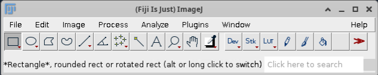
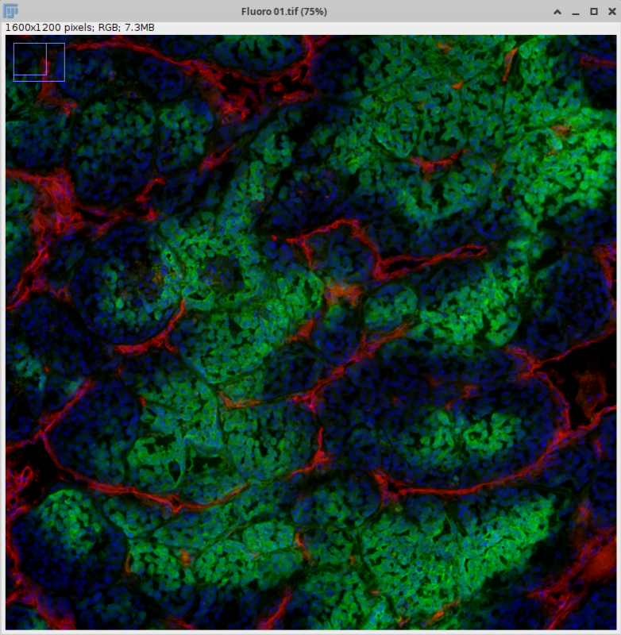
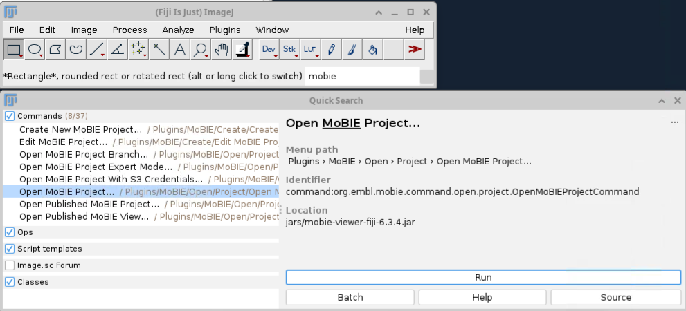
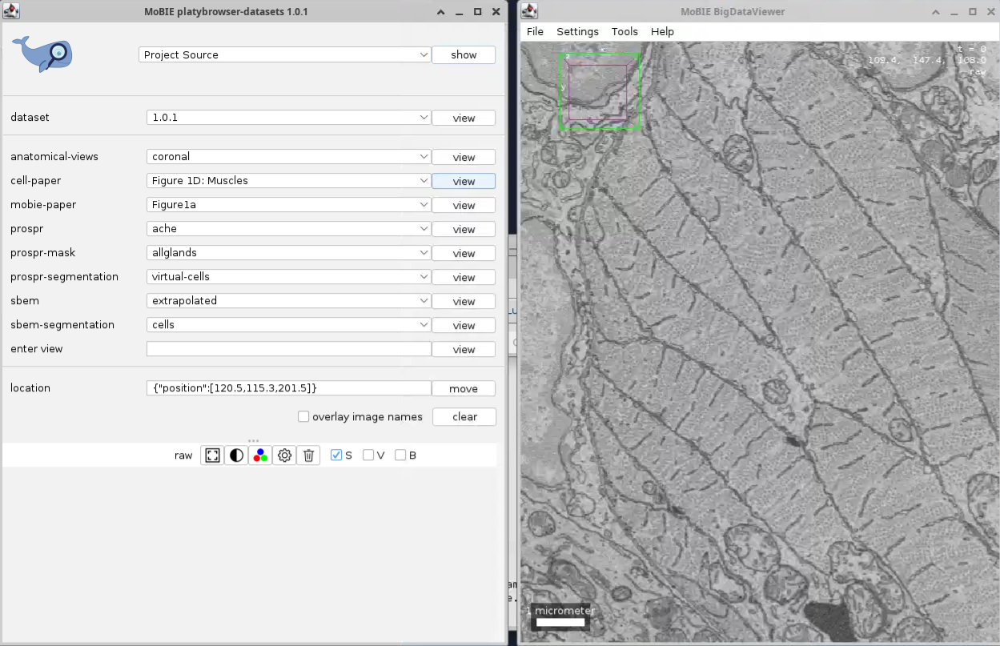

# Fiji with MoBIE
## Introduction
Fiji is an image processing tool that combines the [ImageJ](https://imagej.net/)
software with community  [plugins](https://imagej.net/list-of-extensions) for scientific image processing and analysis.
The RFI [fiji-mobie](https://quay.io/repository/rosalindfranklininstitute/fiji-mobie) container
includes the [MoBIE](https://mobie.github.io/) (Multimodal Big Image Data Exploration) plugin
designed for sharing and interactively browsing large, multi-modal images and
associated tabular data.

## Using Fiji and  MoBIE
**Prerequisites**:
 Fiji is a graphical application that requires a local or remote display server
such as X11 to render its interface. It does not require a GPU.


The Fiji application can be started by pulling and running the container using 
Apptainer:
```
apptainer run docker://quay.io/rosalindfranklininstitute/fiji-mobie
```
It may also be run using Docker. First, execute `xhost +local:` (or `xhost +`
when using a remote system) to allow containers to access the 
current display, then run:
```
docker run \
  -v /path/to/your/data:/data \
  -e DISPLAY=$DISPLAY \
  -v /tmp/.X11-unix:/tmp/.X11-unix \
  --device=/dev/dri:/dev/dri \
  quay.io/rosalindfranklininstitute/fiji-mobie
```
<!--The first time you run either command there will be a brief wait whilst the
container downloads.-->
In each case, if you want to access files outside of the default directories
made available by Apptainer or Docker, add `--bind /path/to/files:/mnt` (Apptainer) or
`-v /path/to/files:/mnt` (Docker). Replace `/path/to/files` with
a location on your machine;
 `mnt` is where those files will appear inside the container (for example,
when using the Fiji file picker `File>Open...`).

!!! warning
    When you start Fiji, a pop-up may prompt you to run the
    Fiji Updater. Close this or select *No/Never*&mdash;even if the
    update was successful, it requires a restart to apply, and so
    would be lost next time you started the container since the software does not
    persist between container sessions. 

### Loading image data

The Fiji application interface consists of a small pane that expands
when an image is loaded.


*The Fiji application toolbar. Status text provides information
on the currently selected option, and a search bar may be used to
easily find commands.*

Fiji supports a wide range of image formats (see [here](https://imagejdocu.list.lu/doku.php?id=faq:general:which_file_formats_are_supported_by_imagej)
for a list) including `.tiff`, `.jpeg` and `.bmp`. You can also load and
 save stacks as image sequences. Below is the Fiji image pane displaying 
 Fluorescence data (`Fluoro 01.tif`)
from the [Monash University Demo Images](https://bridges.monash.edu/articles/dataset/Fiji_Manual_Resources_v6_5_/21902043?file=38851446)[^1].

  
*Fluoroscene image data in Fiji. Fiji can be used to manipulate images
interactively, such as splitting the red (blood vessels) and green
(hypoxia) channels.*


The Fiji website has free [tutorials](https://imagej.net/tutorials/), [manuals](https://imagej.net/learn/user-guides)
and [presentations](https://imagej.net/events/presentations) if you want to
learn more about the range of image processing abilities the application has.
It also explains how you can [contribute](https://imagej.net/contribute/) to its
development.

### Running MoBIE
MoBIE uses the [BigDataViewer](https://imagej.net/plugins/bdv/) to provide
smooth browsing of large image datasets. This includes support for next-gen
image formats such as OME-Zarr and HDF5. You can perform image registration
directly in MoBIE views and explore associated tabular data alongside images
as you view them.

While BigDataViewer can  load view local images, MoBIE adds support for loading
cloud-based projects. To access these, enter "mobie" in the Fiji search bar and
select `Open MoBIE Project`. Pressing `Run` will prompt you to  enter a GitHub
repository containing the target datasets. An example dataset is available at
`https://github.com/mobie/platybrowser-project`[^2]. After entering the
repository URL, the MoBIE project pane opens alongside the BigDataViewer, with
the layered image data ready for you to inspect.  

 

*Loading image data from a repository in MoBIE. 
The mouse scroll wheel can be used to traverse the layer images.
Images show muscle in an Epithelial cell from Fig. 1D of the Cell
publication[^2]. Other views can be selected via the `cell-paper` drop-down menu
.*

The [MoBIE Tutorials Site](https://mobie.github.io/) has  examples and
tutorials for learning more about using MoBIE to perform image registration and
annotation. We recommend starting with the [Basic image browsing tutorial](https://mobie.github.io/tutorials/exploring_images.html)
to understand both the BigDataViewer interface and the structure of Datasets
that MoBIE reads.

## Troubleshooting and Support
### Getting help
If you encounter problems with Fiji or MoBIE, you can
[Create an issue](https://github.com/rosalindfranklininstitute/fiji-mobie/issues/new)
on the container GitHub repository. Please share as much information 
as you can regarding your host system (operating system, container runtime),
the commands you are trying to run as well as any error messages.

## Version and license information
The container currently has

- Fiji 2.16.1 (ImageJ2 2.16.0/1.54p)
- MoBIE 4.0.3

The container is distributed under an [Apache 2.0 License](https://github.com/rosalindfranklininstitute/fiji-mobie?tab=Apache-2.0-1-ov-file).
If you are using this software in your work, consider giving attribution to
the Fiji[^3] and MoBIE[^4] publications.

[^1]: Cameron Nowell, [Fiji Manual Resources v6.5 (2023)](https://bridges.monash.edu/articles/dataset/Fiji_Manual_Resources_v6_5_/21902043?file=38851446).
[^2]: Vergara, H. M. et al., [Cell 184 (18), 4819-4837.e22](https://doi.org/10.1016/j.cell.2021.07.017).
[^3]: Schindelin, J. et al., [Nature Methods, 9, 676–682 (2012)](https://www.nature.com/articles/nmeth.2019).
[^4]: Pape, C. et al., [Nature Methods 20, 475-476 (2023)](https://www.nature.com/articles/s41592-023-01776-4).

## 📚 Further reading

- [Fiji Website](https://fiji.sc/) and [Community Forums](https://forum.image.sc/tag/fiji)
- [MoBIE Tutorials](https://mobie.github.io/)
