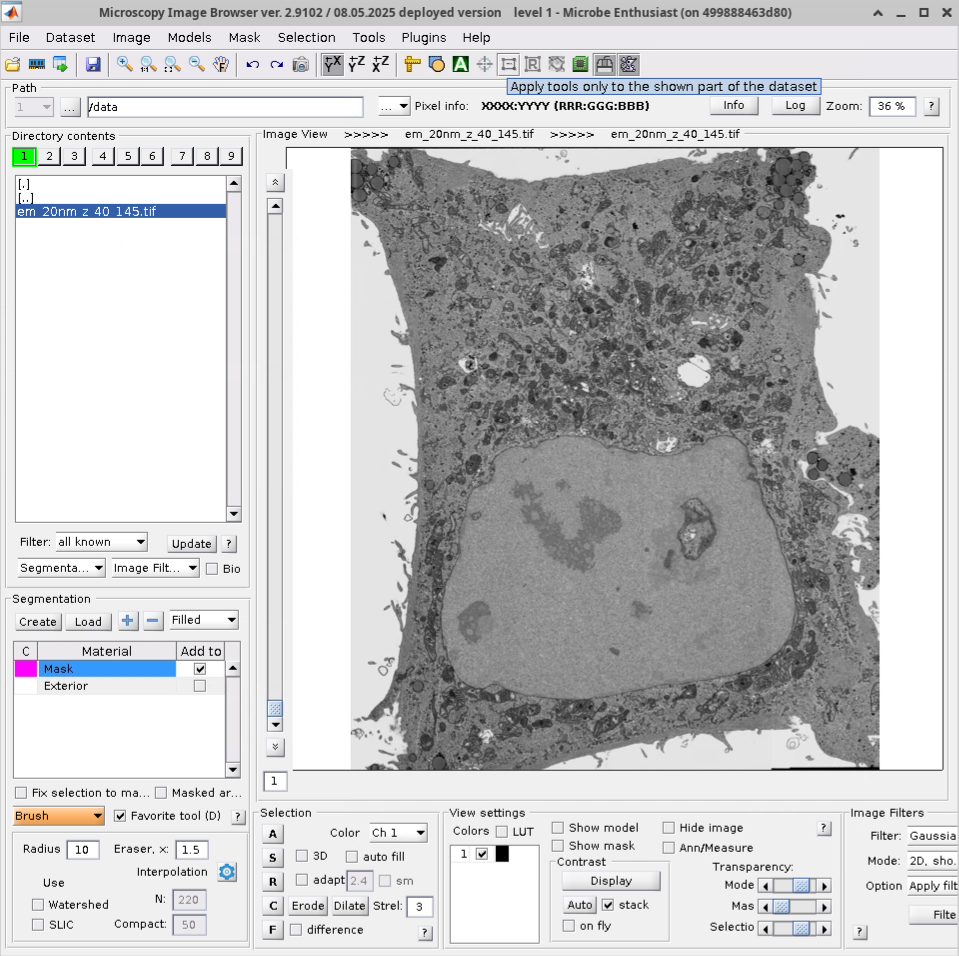

# MIB2
## Introduction
The Microscopy Image Browser (MIB) is a MATLAB-based software package for
processing, segmentation and visualisation of 2-4 dimensional light and electron
microscopy datasets. It includes a built-in tool for training and applying deep
convolutional networks to image segmentation.  The second major release of the
program, MIB2, has been developed since 2010 by Ilya Belevich and other
researchers at the [Institute of
Biotechnology](https://www.helsinki.fi/en/hilife-helsinki-institute-life-science/units/institute-biotechnology)
at the University of Helsinki.


!!! info
    MIB2 is frequently used in conjunction with the SAM2 model for promptable
    visual segmentation in images and videos. SAM2 does not currently work with our
    MIB2 container due to Python version incompatibility, but we are looking to 
    support it in the future.

## Using MIB2
**Prerequisites**:
MIB2 is a graphical application that requires a local or remote display server
such as X11 to render its interface. MIB2 does not require a GPU, but some
segmentation features may leverage GPU acceleration if you have an NVIDIA card.

!!! warning
    While you don't need your own MATLAB license to use MIB2, by using the
    application you agree to the [MATLAB Compiler Runtime libraries
    licence](http://mib.helsinki.fi/Matlab_MCR_license.txt) and the external
    licenses [listed on the MIB
    website](https://mib.helsinki.fi/license_external.html).

### Running the Container
MIB2 can be started by pulling and running the container using Apptainer:
```
apptainer run \
    --nv \
    --env DISPLAY=$DISPLAY \
    --bind /tmp/.X11-unix:/tmp/.X11-unix \
    docker://quay.io/rosalindfranklininstitute/mib-container
```
If you don't have a NVIDIA GPU, omit the `--nv` option. If image data you want
to access is not in your home directory, you will need to mount the data
location to the container by adding  `--bind /path/to/data:/data` to the
above command.

For those using Docker, the host X server must be made accessible 
 to containers by first running `xhost +local:` from the command
line (`xhost +` if you are using a remote connection). Then:
```
docker run \
  --gpus all \
  -v /path/to/data:/data \
  -e DISPLAY=$DISPLAY \
  -v /tmp/.X11-unix:/tmp/.X11-unix \
  --device=/dev/dri:/dev/dri \
  quay.io/rosalindfranklininstitute/mib-container
```
where `--gpus all` may be omitted if you don't have a NVIDIA GPU.
By default, Docker does not make any directories on your system
available to the container, so it is necessary to mount a directory
 `/path/to/data` containing your dataset, as in
`-v /path/to/data:/data` (the data will then appear
 appear under  `/data` in MIB2).

!!! info
    When closing MIB2, the terminal window you started the container from
    may hang. Press `CTRL+C` three times or close the
    terminal window to exit the program completely.

### Interacting with the application

Once MIB2 starts, you can navigate to your data by typing the path in the
toolbar or by clicking through the directory tree in the left panel. Note that
most directories shown refer to locations inside the container; use the `--bind`
(Apptainer) or `-v` (Docker) options described above to make your data accessible.

To load an image, double click on its file name in the directory tree.
MIB2 supports loading and saving images in TIF, Amira
Mesh, JPG, Fiji BigDataViewer, HDF5, MRC, NRRD and PNG  formats. Below shows an
example of electron microscopy data[^1] loaded in MIB2.


*MIB2 Application with 
[Sample Data](https://zenodo.org/records/7936982)
from the CLEM-Reg Paper[^1].*

MIB2 can also load images from remote sources via
the `File>Import image` menu.

To learn about using MIB2's segmentation and visualisation features, consult the
documentation and video tutorials linked in the Useful Links section below. The
MIB2 website includes detailed video tutorials for many common workflows and
features.

!!! tip
    MIB2 has a large number of keyboard shortcuts which can be viewed
    from `File > Preferences`. 

## Troubleshooting and Support
### Known Issues
SAM2 Integration: The current container has a Python version incompatibility
that prevents SAM2 integration. We are working on resolving this in a future
release.
### Getting help
If you encounter  problems with the MIB2 container,
[create an issue](https://github.com/rosalindfranklininstitute/mib-container/issues/new)
on the container GitHub repository. Please share as much information 
as you can regarding your host system (e.g., operating system, container runtime),
the commands you are trying to run as well as any error messages.

## Version and license information
The [RFI container](https://github.com/rosalindfranklininstitute/mib-container)
 provides MIB2 version 2.9102 released 08.05.2025.

The container is distributed under a [GPL-3.0
License](https://github.com/rosalindfranklininstitute/mib-container?tab=GPL-3.0-1-ov-file).
By using MIB2, you agree to the [MATLAB Compiler Runtime libraries
licence](http://mib.helsinki.fi/Matlab_MCR_license.txt) and the external
licenses [listed on the MIB
website](https://mib.helsinki.fi/license_external.html).

When using MIB2, consider citing the original[^2] MIB publication. For those 
using the Deep Learning features, there is the additional DeepMIB paper[^3].

[^1]: Krentzel, D. et al., [Nature Methods 22, 1923–1934 (2025)](https://www.nature.com/articles/s41592-025-02794-0)
[^2]: I. Belevich et al., [PLoS Biology, 14(1):e1002340 (2016)](http://journals.plos.org/plosbiology/article?id=10.1371/journal.pbio.1002340)
[^3]: I. Belevich and E. Jokitalo, [PLoS Comput Biol., 17(3):e1008374 (2021)](https://journals.plos.org/ploscompbiol/article?id=10.1371/journal.pcbi.1008374)

## 🔗 Useful Links

- [MIB2 Website](https://mib.helsinki.fi/index.html)
- [MIB2 Documentation](https://mib.helsinki.fi/help/main2/index.html)
- [MIB2 Features and Video Tutorials](https://mib.helsinki.fi/features_all.html)
- [Electron Microscopy Unit at the University of Helsinki](https://www.helsinki.fi/en/infrastructures/bioimaging/embi)
- [SAM2 by facebookresearch](https://github.com/facebookresearch/sam2)
