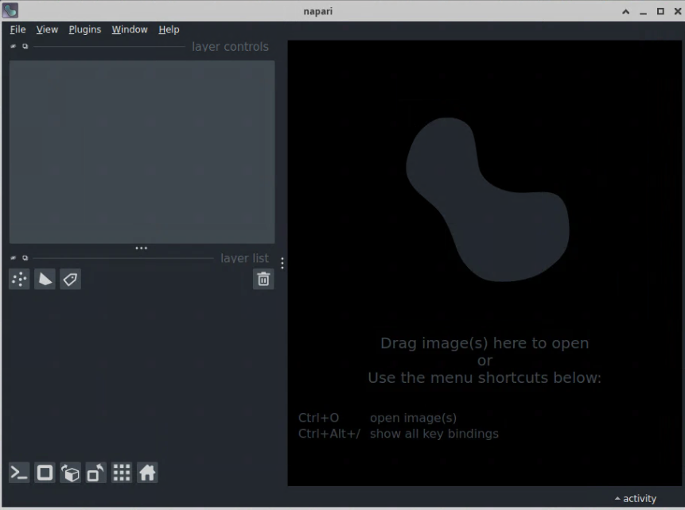
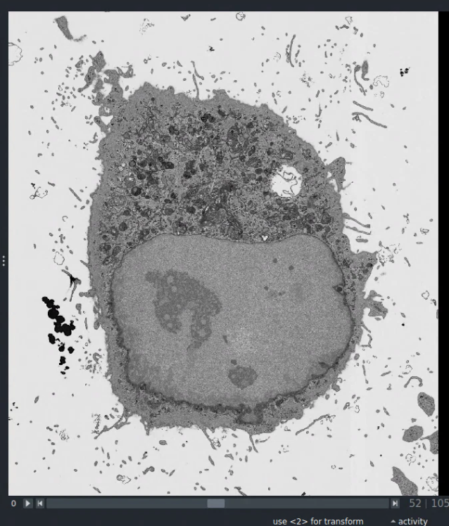

# Napari with Clemreg and Empanada
## Introduction
Napari is a fast, interactive viewer for multi-dimensional images.
It is written in Python and designed to handle large, high-dimensional
datasets. 
For researchers working with volume EM data, it is a powerful tool for tasks
including segmentation, registration and visual inspection of 3D images.
Napari's functionality is extendible through community-developed *plugins*.

!!! tip
    Napari is a community-driven open-source project; you can find more about 
    the community and contributing on the [napari website](https://napari.org/stable/community/index.html).

The RFI [napari-clemreg-empanada container](https://quay.io/repository/rosalindfranklininstitute/napari-clemreg-empanada)
provides a Napari instance with two key plugins for volume EM
workflows:

- CLEM-Reg ([napari-clemreg](https://github.com/krentzd/napari-clemreg)),
  an automated point cloud based registration algorithm
- Empanada ([empanada-napari](https://github.com/volume-em/empanada-napari)),
  for deep learning-based panoptic segmentation of 2D/3D EM images

## Starting Napari
**Prerequisites**: 
This guide assumes you have a graphical environment available (e.g., a local X11
server or accessing a VM through RDP).  Napari is primarily a GUI application
and requires display capabilities to run interactively.

!!! warning
    While Napari may be run without a GPU, the segmentation in Clemreg and 
    Empanada requires a NVIDIA GPU, and the container may crash if you try to
    use these plugins without one.

### Apptainer
First, ensure Apptainer is available on your system (`module load apptainer` for
RFI users). The napari-clemreg-empanada container
may then be started by opening a terminal and running a command of the form: 
```
apptainer run --nv \
  --bind /path/to/data:/data \
  docker://quay.io/rosalindfranklininstitute/napari-clemreg-empanada:latest
```
Arguments:

- `--nv` enables NVIDIA GPU support on Windows and Linux. If you don't have a
  NVIDIA card or are on MacOS, you can omit this option, but the plugins may
  not function correctly.
- `--bind /path/to/data:/data` is required to access data outside
  the common locations provided by Apptainer by default (`/home/$USER`). Replace 
  `/path/to/data` with the actual path to the data directory on your host
machine

### Docker
A running X server must be accessible on the host. X11 will be present by
default in most Linux and WSL (Windows Subsystem for Linux) setups, and can
be made accessible to containers by running `xhost +local:` from the command
line (`xhost +` if you are using a remote connection). 
MacOS users may use a program such as [XQuartz](https://www.xquartz.org/).
The container may then be started with
```
docker run \
  --gpus all \
  -v /path/to/your/data:/data \
  -e DISPLAY=$DISPLAY \
  -v /tmp/.X11-unix:/tmp/.X11-unix \
  --device=/dev/dri:/dev/dri \
  quay.io/rosalindfranklininstitute/napari-clemreg-empanada:latest
```
Similar to Apptainer's `--nv`,
 `--gpus all` may be omitted on a system with a NVIDIA drive, but the
plugins may not function, and `/path/to/data` should be edited 
to the actual path to your image dataset (unlike
Apptainer, Docker does not mount any directories by default).


## Using Napari
If successful, the Napari GUI should open after executing the Apptainer or
Docker `run` commands:

!!! tip
    If the container fails to start, try [Troubleshooting and Support](#troubleshooting-and-support)
    below.



!!! info
    You must keep the terminal window open after launching Napari. 
    To avoid this restriction,
    you can add `& disown` to the end of either `apptainer` or `docker`
    commands above.

Image data may be loaded from the file menu (shortcut `Ctrl+O`) where it
will appear under *Layer List* on the left-hand side of the interface.
For multi-dimensional images, sliders at the bottom of the viewing pane
allow you to step through additional axes (e.g. third dimension or time).

<!--{: style="width:80%"}-->
*The Napari Image Pane with [Sample Data](https://zenodo.org/records/7936982)
from the CLEM-Reg Paper[^1].*

[^1]: Krentzel, D. et al., [Nature Methods 22, 1923–1934 (2025)](https://www.nature.com/articles/s41592-025-02794-0).

The CLEM-Reg and Empanada plugins may be accessed via the *Plugins* menu.
Selecting a function under either plugin will open a new panel to the right-hand
side of the screen, from which registration/segmentation processes can be
configured and started. The screenshot below shows the result of running 
CLEM-Reg registration on the vEM sample dataset of HeLa cells provided with
the original CLEM-Reg study[^1].


For further information on using CLEM-Reg and Empanada, see their respective
GitHub repositories:

- [napari-clemreg](https://github.com/krentzd/napari-clemreg)
- [empanada-napari](https://github.com/volume-em/empanada-napari)

Both provide links to free test datasets you can use to confirm the plugins
are working.

!!! info
    Napari is primarily used through its GUI, but also provides a CLI (e.g. for
    batch processing) and may be imported and used in Python scripts (N.B. you
    must use `/opt/Python-3.9.21/python` executable within the container). See
    [Running napari headlessly](https://napari.org/stable/howtos/headless.html)

## Troubleshooting and Support
### Known Issues
#### D-Bus library incorrectly set up (Apptainer)
Napari may fail to start with the error
```
D-Bus library appears to be incorrectly set up: see the manual page for dbus-uuidgen to correct this issue.
(Failed to open "/var/lib/dbus/machine-id": No such file or directory; UUID file '/etc/machine-id' should contain a hex string of length 32, not length 0, with no other text)
```
A quick solution is to bind your host `machine-id` to the container:
```
apptainer run --nv \
  --bind /path/to/data:/data \
  --bind /var/lib/dbus/machine-id:/var/lib/dbus/machine-id
  docker://quay.io/rosalindfranklininstitute/napari-clemreg-empanada:latest
```

#### Unable to find target for this triple
If the program crashes when running the plugins with an error
```
Program aborted due to an unhandled Error:
Unable to find target for this triple (no targets are registered)
```
This is likely because the application cannot access your NVIDIA card from
within the container. Make sure you have a NVIDIA Card with updated
driver software and are using `--nv` or `--gpus all` in the `apptainer`/`docker`
commands. To check whether Apptainer/Docker is correctly presenting your
GPU, you can start an interactive Shell in the containers with 
`apptainer shell --nv image-url` or `docker run -it image-name` 
(see [Running Containers](../intro/containers.md#running-containers)).

### Getting help
If you are still experiencing issues, you can 
[Create a new issue](https://github.com/rosalindfranklininstitute/napari-clemreg-empanada/issues/new)
on the container GitHub repository. Please share as much information 
as you can regarding your host system (operating system, container runtime),
the commands you are trying to run as well as any error messages.

 
## Version and license information
Python package dependency conflicts between Napari and its plugins can create
significant installation challenges.  The containerisation aims to address this
issue by providing a stable, version locked instance of Napari the CLEM-Reg,
Empanada plugins. The chosen versions are:
 
- napari: 0.4.18
- clemreg: 0.2.1
- empanada: 1.2

The container is distributed under an [Apache 2.0 License](https://github.com/rosalindfranklininstitute/napari-clemreg-empanada?tab=Apache-2.0-1-ov-file).
If you are using this software in your work, considering 
giving attribution to [Napari](https://github.com/napari/napari/blob/main/CITATION.cff)
and the CLEM-Reg[^1], Empanada[^2] publications.

[^2]: Conrad, Ryan et al. [Cell Systems, Volume 14, Issue 1, 58 - 71.e5](https://www.cell.com/cell-systems/fulltext/S2405-4712(22)00494-X).

## 📚 Further reading

- [Napari Website](https://napari.org/stable/community/index.html)
- [Empanada Website](https://empanada.readthedocs.io/en/latest/index.html)
